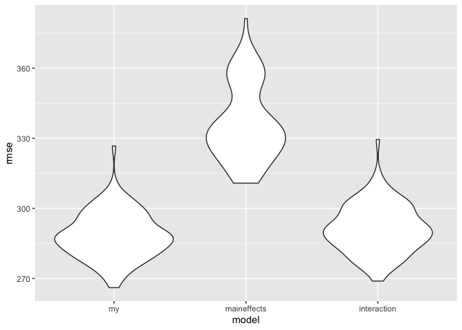

p8105\_hw6\_sl4659
================
Shenglin Liu
11/15/2019

## Problem 1

### Tidy data

``` r
library(tidyverse)
```

    ## ── Attaching packages ────────────────────────────────────────────────────────── tidyverse 1.2.1 ──

    ## ✔ ggplot2 3.2.1     ✔ purrr   0.3.3
    ## ✔ tibble  2.1.3     ✔ dplyr   0.8.3
    ## ✔ tidyr   1.0.0     ✔ stringr 1.4.0
    ## ✔ readr   1.3.1     ✔ forcats 0.4.0

    ## ── Conflicts ───────────────────────────────────────────────────────────── tidyverse_conflicts() ──
    ## ✖ dplyr::filter() masks stats::filter()
    ## ✖ dplyr::lag()    masks stats::lag()

``` r
library(broom)
library(modelr)
```

    ## 
    ## Attaching package: 'modelr'

    ## The following object is masked from 'package:broom':
    ## 
    ##     bootstrap

``` r
library(rvest)
```

    ## Loading required package: xml2

    ## 
    ## Attaching package: 'rvest'

    ## The following object is masked from 'package:purrr':
    ## 
    ##     pluck

    ## The following object is masked from 'package:readr':
    ## 
    ##     guess_encoding

``` r
# read data from birthweight.csv
bw_df = 
  read.csv("./data/birthweight.csv", sep = ",") %>%
  janitor::clean_names()
# check for missing values
sum(is.na(bw_df))
```

    ## [1] 0

``` r
# convert numeric to factor where appropriate
bw_df = bw_df %>%
  mutate(
    babysex = factor(babysex, levels = c(1,2), labels = c("male","female")),
    frace = factor(frace, levels = c(1, 2, 3, 4, 8, 9), labels = c("White", "Black", "Asian", "Puerto Rican", "Other", "Unknown")),
    malform = factor(malform, levels = c(0, 1), labels = c("absent", "present")),
    mrace = factor(mrace, levels = c(1, 2, 3, 4, 8), labels = c("White", "Black", "Asian", "Puerto Rican", "Other"))
  )
```

### Build model

``` r
# SLR model using length at birth as predictor
mod_bw = lm(bwt ~ blength, data = bw_df)
# compute predictions
grid = bw_df %>% 
  data_grid(blength = seq_range(blength, 20)) %>% 
  add_predictions(mod_bw, "bwt")
# overlay the predictions on the raw data
ggplot(bw_df, aes(blength, bwt)) + 
  geom_hex() + 
  geom_line(data = grid, colour = "red", size = 1) +
# title, label and caption
  labs(
    title = "SLR between baby's length at birth and birth weight",
    x = "length (centimeters)",
    y = "birth weight (grams)",
    caption = "Data from birthweight.csv")
```

<!-- -->

The length at birth is the single most important factor for determining
the birth weight of a baby. The heatmap overlaid by the predictions on
the raw data with a simple linear regression model between blength and
bwt can make it easier to see the linear relationship.

``` r
bw_df = bw_df %>% 
  add_residuals(mod_bw, "residual")

# motivating plots using residuals vs babysex, momage, smoken, gaweeks and bhead
ggplot(bw_df, aes(babysex, residual)) + geom_boxplot(aes(group = babysex)) + labs(title = "Figure 1: Residuals vs Baby's sex")
```

<!-- -->

``` r
ggplot(bw_df, aes(momage, residual)) + geom_bin2d(bins = 80) + labs(title = "Figure 2: Residuals vs Mother's age at delivery (years)")
```

<!-- -->

``` r
ggplot(bw_df, aes(smoken, residual)) + geom_bin2d(bins = 80) + labs(title = "Figure 3: Residuals vs Average number of cigarettes smoked per day during pregnancy")
```

<!-- -->

``` r
ggplot(bw_df, aes(gaweeks, residual)) + geom_bin2d(bins = 80) + labs(title = "Figure 4: Residuals vs Gestational age (weeks)")
```

<!-- -->

``` r
ggplot(bw_df, aes(bhead, residual)) + geom_bin2d(bins = 80) + labs(title = "Figure 5: Residuals vs Baby's head circumference at birth (centimeters)")
```

<!-- -->

We can now do our motivating plots using those residuals instead of bwt.
The association between residuals and babysex, momage, smoken, gaweeks,
bhead are investigated with either a boxplot or a a heatmap of 2d bin
counts. This particular set of covariates are chosen because they are
hypothesized to be factors that affect a baby’s birth weight. For
example, previous study shows evidence that women aged 35+ have larger
babies, and teenage pregnancies are more likely to result in babies that
are underweight. From Figure 4, we see that as the gestational age of
the baby increases, so too does its relative birth weight. A similar
association is also observed from Figure 5 for baby’s head
circumference. Therefore, a decision is made to include these two
covariates in the
model.

``` r
# MLR model using length at birth, head circumference and gestational age as predictors
mlr3_bw = lm(bwt ~ blength + bhead + gaweeks, data = bw_df)
summary(mlr3_bw)
```

    ## 
    ## Call:
    ## lm(formula = bwt ~ blength + bhead + gaweeks, data = bw_df)
    ## 
    ## Residuals:
    ##      Min       1Q   Median       3Q      Max 
    ## -1105.73  -191.84   -10.99   178.74  2596.80 
    ## 
    ## Coefficients:
    ##              Estimate Std. Error t value Pr(>|t|)    
    ## (Intercept) -6195.572     96.352 -64.301   <2e-16 ***
    ## blength        81.643      2.084  39.177   <2e-16 ***
    ## bhead         138.853      3.531  39.325   <2e-16 ***
    ## gaweeks        14.601      1.509   9.677   <2e-16 ***
    ## ---
    ## Signif. codes:  0 '***' 0.001 '**' 0.01 '*' 0.05 '.' 0.1 ' ' 1
    ## 
    ## Residual standard error: 286.1 on 4338 degrees of freedom
    ## Multiple R-squared:  0.6881, Adjusted R-squared:  0.6879 
    ## F-statistic:  3190 on 3 and 4338 DF,  p-value: < 2.2e-16

``` r
# use broom::tidy to clean the output of lm
mlr3_fit = tidy(mlr3_bw)
mlr3_fit
```

    ## # A tibble: 4 x 5
    ##   term        estimate std.error statistic   p.value
    ##   <chr>          <dbl>     <dbl>     <dbl>     <dbl>
    ## 1 (Intercept)  -6196.      96.4     -64.3  0.       
    ## 2 blength         81.6      2.08     39.2  1.05e-287
    ## 3 bhead          139.       3.53     39.3  1.45e-289
    ## 4 gaweeks         14.6      1.51      9.68 6.26e- 22

``` r
bw_df = bw_df %>% 
  add_residuals(mlr3_bw, "residual") %>%
  add_predictions(mlr3_bw, "fitted_value")
ggplot(bw_df, aes(x = fitted_value, y = residual)) + geom_point() + labs(title = "Residuals vs Fitted values (centimeters)")
```

<!-- -->

Residuals form a horizontal (linear) ‘band’ around zero: above and below
(indication of equal
variance).

### Compare to two other models

``` r
# preforms the training/testing split 100 times, and stores the datasets using list columns
cv_df =
  crossv_mc(bw_df, 100) %>% 
  mutate(
    train = map(train, as_tibble),
    test = map(test, as_tibble))
# use mutate + map & map2 to fit models to training data and obtain corresponding RMSEs for the testing data
cv_df = 
  cv_df %>% 
  mutate(my_mod  = map(train, ~lm(bwt ~ blength + bhead + gaweeks, data = .x)),
         maineffects_mod = map(train, ~lm(bwt ~ blength + gaweeks, data = .x)),
         interaction_mod  = map(train, ~lm(bwt ~ bhead + blength + babysex + bhead*blength + bhead*babysex + blength*babysex + bhead*blength*babysex, data = .x))) %>% 
  mutate(rmse_my = map2_dbl(my_mod, test, ~rmse(model = .x, data = .y)),
         rmse_maineffects = map2_dbl(maineffects_mod, test, ~rmse(model = .x, data = .y)),
         rmse_interaction = map2_dbl(interaction_mod, test, ~rmse(model = .x, data = .y)))
# plot the prediction error distribution for each candidate model
cv_df %>% 
  select(starts_with("rmse")) %>% 
pivot_longer(
    everything(),
    names_to = "model", 
    values_to = "rmse",
    names_prefix = "rmse_") %>% 
  mutate(model = fct_inorder(model)) %>% 
  ggplot(aes(x = model, y = rmse)) + geom_violin()
```

<!-- -->

Based on these results, there’s clearly some improvement in predictive
accuracy gained by including more predictors (the main effects model
only has two predictors while my model has three and the interaction
model has 7) – whether this is sufficient to justify a more complex
model isn’t obvious, though. My model appears to be a bit better than
the interaction model. In conclusion, I’d probably go with my model.

## Problem 2

### Download and tidy data

``` r
weather_df = 
  rnoaa::meteo_pull_monitors(
    c("USW00094728"),
    var = c("PRCP", "TMIN", "TMAX"), 
    date_min = "2017-01-01",
    date_max = "2017-12-31") %>%
  mutate(
    name = recode(id, USW00094728 = "CentralPark_NY"),
    tmin = tmin / 10,
    tmax = tmax / 10) %>%
  select(name, id, everything())
```

    ## Registered S3 method overwritten by 'hoardr':
    ##   method           from
    ##   print.cache_info httr

    ## file path:          /Users/shenglin/Library/Caches/rnoaa/ghcnd/USW00094728.dly

    ## file last updated:  2019-11-18 14:19:58

    ## file min/max dates: 1869-01-01 / 2019-11-30

### Bootstrap

``` r
strap_df = weather_df %>% 
  bootstrap(n = 5000) %>% 
  mutate(
    models = map(strap, ~ lm(tmax ~ tmin, data = .x)),
    tidy_results = map(models, tidy),
    glance_results = map(models, glance))
```

``` r
# extract beta0_hat and beta1_hat from a fitted regression
tidy_df = strap_df %>% 
  unnest(tidy_results)
tidy_df = data.frame(tidy_df$.id, tidy_df$term, tidy_df$estimate) %>%
  pivot_wider(
  names_from = "tidy_df.term", 
  values_from = "tidy_df.estimate")
names(tidy_df)[2] = "Intercept"
# compute log(beta0_hat*beta0_hat) and plot density distribution
tidy_df = tidy_df %>%
  mutate(
    log = log(Intercept*tmin)
  ) 
ggplot(tidy_df, aes(x = log)) + geom_density() + labs(title = "Distribution of log(beta0_hat*beta0_hat)")
```

-1.png)<!-- -->

``` r
# identify the 2.5% and 97.5% quantiles to provide a 95% confidence interval for log(beta0_hat*beta0_hat)
quantile(tidy_df$log, c(.025, .975))
```

    ##     2.5%    97.5% 
    ## 1.966234 2.059008

The distribution of log(beta0\_hat\*beta0\_hat) basically follows
normality while having a bit tail extending to low values, features that
may be related to the frequency with which outliers are included in the
bootstrap
sample.

``` r
# extract r.squared from a fitted regression and plot density distribution
glance_df = strap_df %>% 
  unnest(glance_results)
ggplot(glance_df, aes(x = r.squared)) + geom_density() + labs(title = "Distribution of r.squared")
```

<!-- -->

``` r
# identify the 2.5% and 97.5% quantiles to provide a 95% confidence interval for r.squared
quantile(glance_df$r.squared, c(.025, .975))
```

    ##      2.5%     97.5% 
    ## 0.8939742 0.9274581

Similar to log(beta0\_hat\*beta0\_hat), the distribution of r.squared
has an approximately bell-shaped curve that suggests normality, while it
also has a bit tail extending to low values, features that may be
related to the frequency with which outliers are included in the
bootstrap sample.
